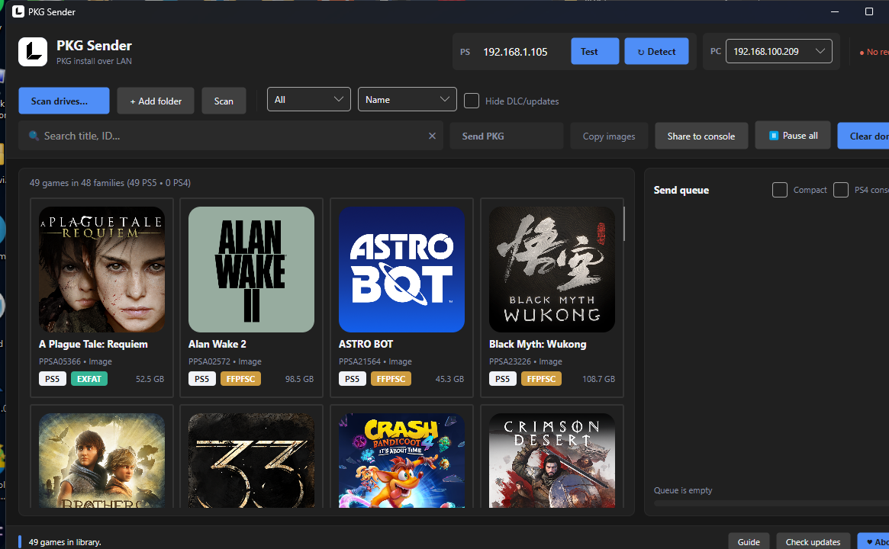
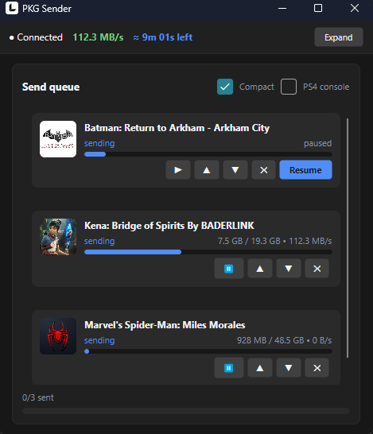

# PKG Sender — PS4 / PS5

**PKG Sender** installs PlayStation packages over LAN: pick games on your PC, they queue up and install on the console. No USB juggling, no manual IP typing.

## Download

Get `PkgSender-Setup-X.Y.Z.exe` from [Releases](../../releases) — self-contained, no .NET needed, no admin needed.

## Setup

1. Jailbreak your PS5 and send `pkg-receiver.elf` (ships inside the install folder). Wait for the console toast *listening on port 12800*.
2. Put the console on the same network as this PC (Wi-Fi or LAN). The console itself needs no internet.
3. Open PKG Sender — it finds the console by itself (receiver beacon first, LAN sweep as fallback). If the console got a new DHCP address, it asks: *switch to it?*
4. Press **Scan drives…** (or **+ Add folder**), select games, press **Send PKG**.

On first launch the About window opens (support links live there).

## LAN connection

PKG Sender connects to your PS5/PS4 in two ways.

### Method 1 — Through a router

The easiest option — connect both your PC and console to the same router.

```
PC ─────┐
        ├── Router
PS5/PS4 ┘
```

You don't need to configure IP addresses manually.

1. Connect your PC to the router using Ethernet or Wi-Fi.
2. Connect your PS5/PS4 to the same router.
3. Start the PKG Receiver on your console.
4. Open PKG Sender — it discovers the console on your local network automatically.

### Method 2 — Direct Ethernet connection

PC straight to PS5/PS4 with an Ethernet cable, no router.

```
PC ───────── Ethernet ───────── PS5/PS4
192.168.10.1                  192.168.10.2
```

Because there is no router providing DHCP, you must manually assign an IP address to both devices.

**1. Set the PC IP address.** On Windows: Settings → Network & Internet → Ethernet → IP assignment → Edit. Select Manual, enable IPv4, and enter:

- IP address: `192.168.10.1`
- Subnet mask: `255.255.255.0`
- Gateway: leave empty
- DNS: leave empty

**2. Set the PS5/PS4 IP address.** Configure the console's Ethernet connection with:

- IP address: `192.168.10.2`
- Subnet mask: `255.255.255.0`
- Gateway: leave empty
- DNS: leave empty

The important part is that both devices are on the same subnet (`255.255.255.0`).

**3. Start the PKG Receiver** on the console, then launch PKG Sender on your PC. In the app pick the PC address from the PC box, type the console IP, press **Test**.

> ⚠ Do NOT leave a direct cable on automatic IP assignment. Windows or the console may fall back to a `169.254.x.x` address when no DHCP server is available — PKG Sender ignores these automatic link-local addresses on purpose. If the cable is plugged in but nothing is found, this is almost always the cause.

## PS4

Works with a jailbroken PS4 running a compatible package receiver (listening on port 12800): Test should go green and Send PKG works. Tick **PS4 console** above the queue — PS4 installs go strictly one-by-one (PS5 queues natively).

## Features

- Zero-config networking: auto PC address, console auto-detect with switch prompt, live status dot, re-scan (↻) button
- Library: cover art, Title ID, version, size; filter PS5/PS4, sort name/size, search with in-bar clear (✕)
- Family linking: updates and DLCs stay glued to their base game (exact Title ID — regions stay separate); 🔗 chip shows the family, click to filter, click again to go back
- Send queue with per-file progress, resume, stop, clear-done (orphaned rows included)
- Self-updating: silent check at startup, footer button lights up on new release (off switch in About for offline PCs)
- Guide window with setup + troubleshooting, first-run About

## Receiver API

The receiver listens on `http://<console-ip>:12800`. File paths are jailed
under `/data/homebrew`. This API is not stable and may change between versions.

| Method | Path | Input | Reply |
| ------ | ---- | ----- | ----- |
| GET | `/api` | — | probe (online check, no action) |
| GET | `/api/status` | — | `{"busy":bool,"active":N}` |
| POST | `/api/install` | `{"packages":["<url>"],"name":"...","icon_url":"..."}` (`name`/`icon_url` optional) | `{"status":"success"}` or `{"status":"fail",...}` |
| GET | `/install?url=` | PKG URL as query arg | starts install, plain-text reply |
| GET | `/api/files/stat?path=` | remote path | `{"exists":bool,"size":N}` |
| POST | `/api/files/mkdir` | `{"path":"..."}` | `{"ok":true}` or `error:...` |
| POST | `/api/files/write?path=&offset=` | raw bytes, offset in bytes | `{"ok":true}` or `error:...` |
| POST | `/api/files/done` | `{"path":"...","size":N}` (verifies size) | `{"ok":true,"size":N}` or `error:size mismatch` |

Discovery: the receiver broadcasts `PKGSENDER v1` to UDP `255.255.255.255:12801`
every 3 seconds.

Example (check, upload one chunk at offset 0, finalize):

```sh
curl "http://<console-ip>:12800/api/files/stat?path=mygame.pkg"
curl -X POST --data-binary @chunk0.bin "http://<console-ip>:12800/api/files/write?path=mygame.pkg&offset=0"
curl -X POST -H "Content-Type: application/json" \
  -d '{"path":"mygame.pkg","size":123456}' http://<console-ip>:12800/api/files/done
```

## Screenshots





## Support

If you enjoy what I build and want to support my work, you can donate — every bit means a lot. 💙

- USDT (BEP-20): `0x839a30D52Ef7D2b53e818b9931efd7FE6F472e50`
  ([send via TrustWallet](https://link.trustwallet.com/send?coin=20000714&address=0x839a30D52Ef7D2b53e818b9931efd7FE6F472e50&token_id=0x55d398326f99059fF775485246999027B3197955))
- More: [loopayeh.github.io](https://loopayeh.github.io/)

## Troubleshooting

- **● No receiver (red)** — the elf isn't running on the console. Send it again.
- **○ No network (gray)** — this PC has no active LAN/Wi-Fi.
- **Push goes through but download never starts** — allow inbound TCP port 9898 in Windows Firewall (the installer adds this rule plus UDP 12801 for beacons).
- **Console IP keeps changing (DHCP)** — reopen the app or hit ↻; it offers the new address.

## Build from source

Needs .NET 8 SDK (+ Inno Setup 6 for the installer):

```bat
Build-Release.bat
```

This publishes a self-contained single-file build to `dist\` and, if `iscc` is available, produces `PkgSender-Setup-X.Y.Z.exe`. The PS5 receiver rebuilds with the ps5-payload-sdk toolchain:

```sh
cd payload && make PS5_PAYLOAD_SDK=/path/to/ps5-payload-sdk
```

## How updates work

The app checks GitHub releases for a `PkgSender-Setup-*.exe` asset newer than its own version. **Download + Install** fetches it to a temp dir, launches it silent, and exits so Setup can overwrite the running app.
